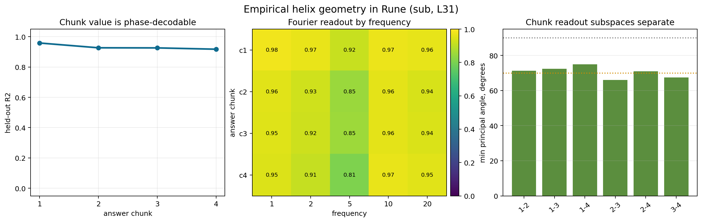

# Rune


Rune is a mechanism-aware JIT compilation project for language-model
arithmetic. It studies whether a model's internal activations can expose the
operation and operands behind an arithmetic prompt, and whether those internal
readouts can be used to route computation without falling back to prompt
parsing.

This repository focuses on one narrow version of that question:

> Can arithmetic operation and operand information be read from model
> activations well enough to route an opaque prompt to a calculator, without
> parsing the prompt text at inference time?

The answer supported here is deliberately scoped. On the published Llama-3.1-8B
slices, activation-derived operation and operand readouts can provide calculator
arguments for several arithmetic tasks. The prompt is treated as opaque at
routing time: the route gets token IDs and captured activations, not a regex over
the text. This is not a claim that the model's native arithmetic has been
repaired, and it is not a residual JIT replacement that resumes generation from
a patched hidden state.

## Start Here

- Read the article abstract at `docs/article_abstract.md`.
- Read the ACM Queue-style pitch abstract at
  `docs/acm_queue_pitch_abstract.md`.
- Read the interactive article locally at `docs/article_interactive/index.html`.
- Read the exported PDF at
  `docs/article_interactive/rune_matrix_arithmetic_article.pdf`.
- Check the paper-facing claim boundary in
  `docs/research/648_goalB3_claim_control_2026-06-03.md`.
- Rebuild the main checks with the commands below.

## Prior Work And Attribution

Rune is not claiming to have discovered that language models can use tools,
that arithmetic can have geometric internal representations, or that activation
patching can test causal hypotheses. It builds on those lines and narrows the
question to provenance: can the operation and operands for a calculator route
come from model activations rather than prompt parsing?

Important influences:

- Lakoff and Núñez's *Where Mathematics Comes From* frames the human contrast:
  mathematics as grounded in embodied experience.
- Kantamneni and Tegmark's
  [Language Models Use Trigonometry to Do Addition](https://arxiv.org/abs/2502.00873)
  is the direct prior for the generalized-helix / trigonometric number-code
  story.
- Nikankin, Reusch, Mueller, and Belinkov's
  [Arithmetic Without Algorithms](https://arxiv.org/abs/2410.21272) motivates
  caution: model arithmetic can be a bag of learned heuristics rather than a
  clean schoolbook algorithm.
- Stolfo, Belinkov, and Sachan's
  [causal mediation study of arithmetic reasoning](https://arxiv.org/abs/2305.15054)
  is prior work on arithmetic mechanisms and causal interventions in language
  models.
- [PAL](https://arxiv.org/abs/2211.10435),
  [Program of Thoughts](https://arxiv.org/abs/2211.12588),
  [ReAct](https://arxiv.org/abs/2210.03629), and
  [Toolformer](https://arxiv.org/abs/2302.04761) are prior tool-use routes.
  Rune's narrower question is where the tool arguments come from.
- Sparse autoencoder and dictionary-learning work, including Anthropic's
  [Towards Monosemanticity](https://transformer-circuits.pub/2023/monosemantic-features/)
  and Cunningham et al.'s
  [SAE paper](https://arxiv.org/abs/2309.08600), motivates the
  readout-vs-feature-vocabulary distinction used in the article.
- Zhang and Nanda's
  [activation-patching best-practice work](https://arxiv.org/abs/2309.16042)
  motivates the article's separation between readout, causal patching, and
  writable replacement.
- The
  [DeepMind Mathematics Dataset](https://github.com/google-deepmind/mathematics_dataset)
  is associated with Saxton et al.'s
  [Analysing Mathematical Reasoning Abilities of Neural Models](https://arxiv.org/abs/1904.01557);
  Rune uses a recognized-source slice of that dataset for part of the
  evaluation.

## Main Results

The strongest supported result is the Goal B3 activation-derived route. In
plain terms, Rune tries to make the model carry the hard part: the operation
label and operands must come from internal activations. Only after that decoded
tuple exists does ordinary Python compute the answer.

```text
opaque prompt token IDs + captured activations
  -> activation-derived operation and safety gates
  -> activation-derived operand tuple
  -> Python calculator after decoded (op, a, b)
  -> exact-answer scoring
```

The runtime contract is important. At inference time, the route is not allowed
to use regexes over the prompt, hidden harness operands, gold answers, CLI
operation labels, or decoded prompt spans. Python is only allowed after the
model activations have supplied a decoded `(op, a, b)` tuple.

This makes the result different from a normal tool call. A normal tool call can
parse "what is 84 times 37" from the text. Rune's published route asks whether
the model's own residual stream contains enough information to recover
`mul(84, 37)` without looking back at the prompt string.

### Broad Frozen Arithmetic Slice

How to read the result terms:

- **Route / routed rate**: the activation-derived calculator path chose to run.
  A high routed rate is good on real arithmetic prompts.
- **Frozen model**: the underlying Llama weights were not trained or fine-tuned
  during this evaluation. Only the external readouts and routing rules were
  tested.
- **Gate**: a decision rule that says whether the calculator route is allowed
  to run.
- **Exact-answer lift**: how much exact-answer accuracy improved over the
  frozen model answering by itself. Positive lift is good.
- **Fire**: the route ran the calculator.
- **False fire**: the route ran the calculator on a prompt where it should have
  stayed silent. Lower is better; zero means none were observed in that audit.
- **Hard negative**: a deliberately tricky non-trigger prompt. It may contain
  numbers, quoted equations, tables, code, or instructions such as "do not
  compute," but the correct behavior is not to call the calculator.
- **Locked examples**: examples, thresholds, and scoring rules fixed before the
  final aggregate was computed, so the result is not tuned after seeing the
  final answers.
- **Adversarial prompts**: test prompts written to tempt the route into doing
  the wrong thing, for example by mentioning arithmetic in a context where no
  calculation should be performed.

`docs/goalB3_final_broad_frozen_arithmetic_adversarial_cross_seed.md` aggregates
three Llama-3.1-8B seeds over 11,736 locked examples and 1,536 target examples.
It reports `GOAL_B3_BENCHMARK_CROSS_SEED_PASS` for four operations:

| operation | mean routed rate | mean exact-answer lift | max false-fire rate |
|---|---:|---:|---:|
| `mul` | 0.865 | 0.852 | 0.000 |
| `div_remainder` | 0.909 | 0.693 | 0.000 |
| `lcm` | 0.969 | 0.966 | 0.000 |
| `gcd` | 0.922 | 0.594 | 0.000 |

The independent hard-negative audit in
`docs/goalB3_final_independent_hard_negative_summary.md` covers 10,200 prompts
where the route should not run. The categories include wrong-operation,
quoted-arithmetic, do-not-compute, decimal/sign, distractor-heavy, and
table/log/code/invoice examples. It records zero fires, which is a good result
inside that test: none of those constructed non-trigger prompts made the route
call the calculator.

### DeepMind Recognized-Source Slice

`docs/goalB3_deepmind_source_audit.md` explains which DeepMind Mathematics
Dataset files produced enough recognized examples for the final route. Here
**recognized** means the audit could map the dataset prompt to one of the
supported forms: two integer operands, a supported operation, and a checkable
answer. The accepted source slice covered `gcd`, `div_remainder`, and `lcm`;
multiplication was not included in the DeepMind claim because the source
filtering did not produce enough accepted two-integer multiplication targets for
a powered result.

`docs/goalB3_final_deepmind_interpolate_recognized_cross_seed.md` aggregates
three seeds over 3,822 locked examples and 1,233 target examples. It reports
strong exact-answer lifts with zero recorded false fires on the recognized
three-operation slice.

### Causal Interchange Status

`docs/goalB3_final_deepmind_causal_interchange_cross_seed_powered.md` separates
rate success from statistical power. `div_remainder` passes the frozen causal
gate with 75 total pairs. `gcd` and `lcm` show donor-follow/control rates in the
right direction but are marked `CAUSAL_UNDERPOWERED` because they do not meet
the preregistered pair-count gate.

### Provenance Audits

Rune includes compact provenance checks. **Provenance** means the audit trail
for where the calculator arguments came from. In this project, a clean
provenance result means the route can be replayed from allowed runtime artifacts
without prompt text, regex matches, hidden operands, operation labels, or gold
answers leaking in.

- `docs/goalB3_final_replay_provenance_audit_full.md`: 15,558 replay bundles,
  zero failed bundles, and no forbidden runtime fields.
- `docs/goalB3_final_broad_frozen_arithmetic_adversarial_cross_seed.md`: final
  broad benchmark aggregate.
- `docs/goalB3_final_manifest_verify.json`: frozen manifest verification.

These audits check emitted records and replay bundles. They complement, but do
not replace, source review of the scripts.

## Helix And Resolution Evidence

The article also explains a separate, visual story: a model has no fingers,
beads, or written columns; it has vectors. Several experiments show arithmetic
quantities being represented with Fourier-like phase structure, and then show
where that representation becomes crowded.



Published evidence:

- `docs/cd_e10_operand_scaling.md`: Llama-3.1-8B subtraction free-generation
  stays high at 6 digits, falls to 63.33% at 10 digits, and crosses the 50%
  exact-match threshold between 13 and 14 digits.
- `docs/eg_e2c_helix_resolution_sub.md`: chunk-level Fourier readouts for
  correct 12-digit subtraction answers, including per-chunk R² and angular
  reconstruction error.
- `docs/eg_e2d_helix_resolution_5chunk_sub.md`: compares 12-digit and
  14-digit subtraction patterns; two of three crowding predictions pass.
- `docs/eg_e2e_crowding_vs_chunks_sub_all.md`: shows that crowding is not a
  simple monotone curve across every chunk pattern.
- `docs/eg_e2h_crowding_llama31_8b_sub.md`: summarizes adjacent-chunk subspace
  angles across digit patterns on Llama-3.1-8B.

## What This Does Not Claim

Rune does not claim:

- that the model's native next-token arithmetic computation was made exact;
- that the route performs residual-stream replacement and resumes the model
  from an internally patched state;
- that a parser is acceptable at inference time;
- that the DeepMind multiplication task passed the final recognized-source
  coverage gate;
- that the Qwen route transferred. The included Qwen diagnostic reports
  `QWEN_OPERAND_ROUTE_FAIL`;
- that the causal result is fully powered for every operation. `gcd` and `lcm`
  are explicitly underpowered in the final DeepMind causal-interchange summary.

## Reproducing

Use Python 3.11. The project metadata declares the core dependencies:

```bash
python -m venv .venv
.venv/bin/pip install -e '.[dev]'
```

Model and dataset caches should be configured through environment variables,
not hardcoded local paths:

```bash
export HF_HOME=/path/to/huggingface/cache
export RUNE_CACHE_DIR=/path/to/rune/cache
export DEEPMIND_MATH_ROOT=/path/to/mathematics_dataset-v1.0
```

Run commands from the repository root:

```bash
# Verify the frozen manifest.
.venv/bin/python scripts/goalB3_final_manifest_verify.py

# Audit DeepMind source coverage.
.venv/bin/python scripts/goalB3_deepmind_source_audit.py \
  --dm_root "$DEEPMIND_MATH_ROOT"

# Rebuild the broad cross-seed aggregate from compact summaries.
.venv/bin/python scripts/goalB3_benchmark_cross_seed_summary.py \
  --out_json docs/goalB3_final_broad_frozen_arithmetic_adversarial_cross_seed.json \
  --out_md docs/goalB3_final_broad_frozen_arithmetic_adversarial_cross_seed.md

# Rebuild the independent hard-negative summary.
.venv/bin/python scripts/goalB3_independent_hard_negative_summary.py \
  --out_json docs/goalB3_final_independent_hard_negative_summary.json \
  --out_md docs/goalB3_final_independent_hard_negative_summary.md

# Regenerate article figures and the PDF.
.venv/bin/python scripts/article_helix_figures.py
.venv/bin/python scripts/export_article_pdf.py
```

The PDF is built from `docs/article_latex/rune_matrix_arithmetic_article.tex`
with `tectonic` and written to
`docs/article_interactive/rune_matrix_arithmetic_article.pdf`.

Some experiments require local model access and a DeepMind Mathematics Dataset
checkout. The regression tests exercise the compact evidence summaries and
script-level invariants.

Run the regression tests with:

```bash
.venv/bin/python -m pytest tests/gold
```
